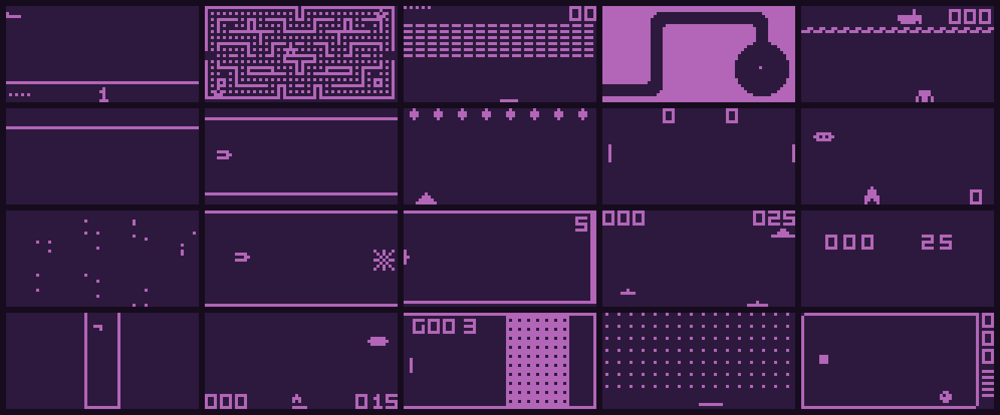
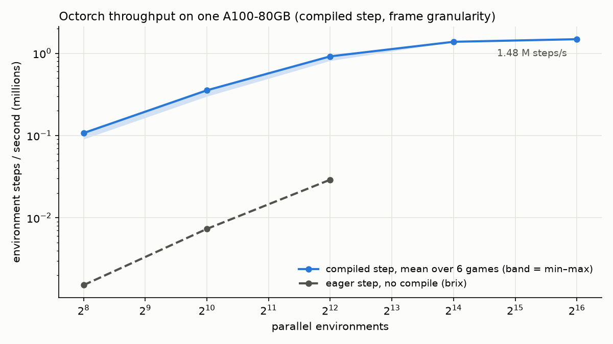
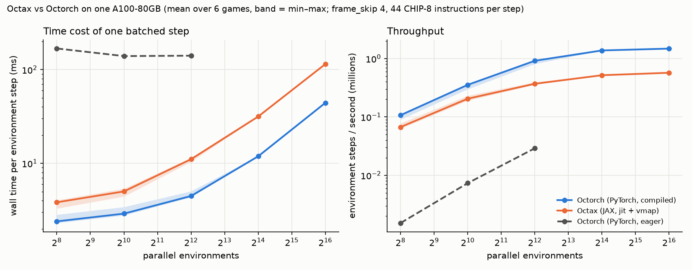
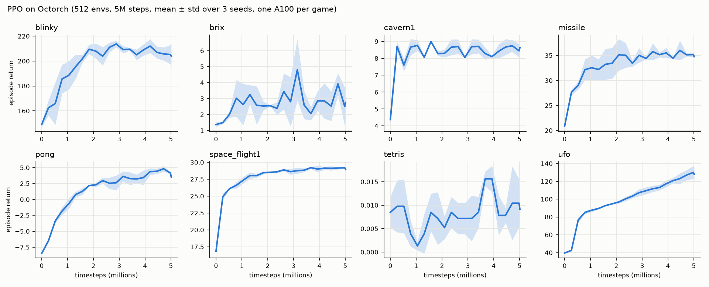

# OCTORCH: Accelerated CHIP-8 Arcade Environments for Reinforcement Learning in PyTorch


**Octorch is a PyTorch port of [Octax](https://github.com/riiswa/octax)** ("Octax: Accelerated CHIP-8 Arcade Environments for Reinforcement Learning in JAX", Radji, Michel & Piteau, 2025, [arXiv:2510.01764](https://arxiv.org/abs/2510.01764)).
It reproduces the full Octax feature set – the CHIP-8 emulator, the 39 game environments (22 games incl. levels), Gym-style
`reset` / `step`, rendering, PPO / PQN reference agents – on top of `torch` tensors, so thousands of
CHIP-8 games run in parallel on a GPU inside an ordinary PyTorch training loop.

The emulator is **bit-exact with Octax**: every game was replayed against the original JAX
implementation for 150 environment steps (6 600 CHIP-8 instructions) with identical actions and random
streams, and every observation, register, program counter, reward, termination flag and score matched
(see [Validation](#validation)).

<p align="center"><br>
<em>20 of the games, random policy, rendered with Octorch (<code>create_mosaic_gif.py</code>)</em></p>

## Why a PyTorch port?

Octax relies on `jax.jit` / `jax.vmap` / `lax.scan`. Octorch makes the batching *explicit*: every field of
the emulator state carries a leading batch dimension, and each instruction handler computes its effect for
the whole batch under an opcode mask – exactly what XLA does when it `vmap`s a `lax.switch`. The result is
a plain PyTorch module that:

- runs on CPU or CUDA with no compilation step (eager mode), or
- compiles with `torch.compile` + CUDA graphs to **> 1M environment steps / second on one A100**,
- interoperates with the PyTorch RL ecosystem (torchrl, CleanRL-style loops, gymnasium vector API).

## Installation

Octorch is managed with [uv](https://docs.astral.sh/uv/). The `pyproject.toml` pins the PyTorch
`cu126` wheel index (CUDA 12.6, matching NVIDIA driver 535+). Adjust `[[tool.uv.index]]` if you need
another CUDA version (`cu128`, `cu130`) or a CPU-only build.

```bash
git clone git@github.com:ZW471/octorch.git
cd octorch
uv sync                              # core: torch, numpy, tqdm
uv sync --extra dev                  # + pytest
uv sync --extra training             # + pyyaml, gymnasium
uv sync --extra gui                  # + pygame, opencv, pillow, matplotlib
uv sync --extra validate             # + jax / octax for the cross-validation tests
```

Check the GPU build:

```bash
uv run python -c "import torch; print(torch.__version__, torch.cuda.is_available(), torch.version.cuda)"
# 2.14.0+cu126 True 12.6
```

## Quick start

### Basic environment usage

```python
import torch
from octorch.environments import create_environment

env, metadata = create_environment("brix")        # lives on CUDA if available
print(f"Playing: {metadata['title']}")

# A batch of 1024 environments; every environment gets its own PRNG stream.
state, obs, info = env.reset(seed := 0, batch_size=1024)
print(obs.shape)                                   # (1024, frame_skip=4, 64, 32) bool

total_reward = torch.zeros(1024, device=env.device)
for _ in range(1000):
    action = torch.randint(0, env.num_actions, (1024,), device=env.device)
    state, obs, reward, terminated, truncated, info = env.step(state, action)
    total_reward += reward
    state = env.reset_where(state, terminated | truncated)   # partial reset, batch shape unchanged
print(f"Mean reward: {total_reward.mean():.2f} ± {total_reward.std():.2f}")
```

`batch_size=None` (the default) gives the unbatched, single-environment behaviour of Octax:

```python
state, obs, info = env.reset(0)                    # obs: (4, 64, 32)
state, obs, reward, terminated, truncated, info = env.step(state, 1)
```

### Compiled stepping (recommended on GPU)

```python
env, _ = create_environment("brix")
env.compile(batch_size=8192)                       # torch.compile + CUDA graph, ~1.5 min once
state, obs, info = env.reset(0, batch_size=8192)   # any state of that batch shape now uses the graph
state, obs, reward, terminated, truncated, info = env.step(state, action)
```

`granularity="instruction" | "frame" | "step"` trades compile time for throughput (see
[Performance](#performance)); the compiled step is verified bit-exact against eager execution.

### Vectorised training loop

```python
from octorch.environments import create_environment
from octorch.wrappers import OctorchVectorEnv

env, _ = create_environment("brix")
env.compile(512)
venv = OctorchVectorEnv(env, num_envs=512, seed=0)   # auto-resets finished episodes
obs, info = venv.reset()                              # (512, 4, 32, 64) float32, H before W
for _ in range(100):
    action = torch.randint(0, venv.num_actions, (512,), device=venv.device)
    obs, reward, terminated, truncated, info = venv.step(action)
```

`octorch.wrappers.make_gymnasium_env` wraps the same thing as a `gymnasium.vector.VectorEnv` with numpy I/O.

### Reference agents

```bash
uv run python train.py --env brix --agent PPO --num-envs 512 --total-timesteps 5000000 --compile-env
uv run python train.py --config conf/config.yaml
```

`octorch.agents.PPOOctorch` and `octorch.agents.PQNOctorch` are ports of the Octax / rejax agents
(same convolutional torso `(32, 64, 64)` / kernels `((8,4), 4, 3)` / strides `((4,2), 2, 1)`, same
GAE / λ-return computations, same hyper-parameter surface).

**Observation space**: the raw CHIP-8 display as a `(frame_skip, 64, 32)` boolean tensor (`(frame_skip, 32, 64)` float32
through the vector wrapper), `frame_skip = 4` by default.

**Action space**: `Discrete(len(action_set) + 1)`; the last action is a no-op. Games declare their own key subsets
(`Pong: [1, 4]`, `Brix: [4, 6]`, `Tetris: [4, 5, 6, 7]`, …).

## Available games

| Category        | Games                                                                  |
| --------------- | ---------------------------------------------------------------------- |
| **Puzzle**      | Tetris, Blinky, Worm                                                   |
| **Action**      | Brix, Pong, Squash, Vertical Brix, Wipe Off, Filter                    |
| **Strategy**    | Missile Command, Rocket, Submarine, Tank Battle, UFO                   |
| **Exploration** | Cavern (levels 1–6, incl. 4a/4b), Flight Runner, Space Flight (1–10), Spacejam! |
| **Shooter**     | Airplane, Deep8, Shooting Stars                                        |
| **LLM-generated** | Target Shooter (levels 1–3)                                          |

`octorch.environments.ENV_IDS` lists all 39 ids. ROMs are the ones shipped with Octax (`roms/`), including its
modified Cavern / Space Flight / Worm / Flight Runner ROMs.

## Performance

Brix, one NVIDIA A100-80GB, `frame_skip=4`, 11 instructions per frame (44 CHIP-8 instructions per step),
PyTorch 2.14.0+cu126. Numbers are environment steps per second (one step = one action for one environment).

| mode                                   | 1 024 envs | 8 192 envs | 32 768 envs | compile time |
| -------------------------------------- | ---------: | ---------: | ----------: | -----------: |
| eager                                  |     ~8 K   |    ~60 K   |           – |            0 |
| `compile(granularity="instruction")`   | 0.27 M | 0.87 M | 1.07 M | ~35 s cold / 17 s cached |
| `compile(granularity="frame")` (default)| 0.30 M | 1.16 M | 1.53 M | ~90 s cold / 9 s cached |
| `compile(granularity="step")`          | 0.36 M | 1.24 M | 1.66 M | ~270 s cold |

Eager execution launches ~550 small CUDA kernels per CHIP-8 instruction and is launch-bound;
`torch.compile` fuses them into ~30 and the CUDA graph removes the launch overhead entirely. Inductor's
on-disk cache makes recompilation in a new process much faster than the cold numbers above.
The scalar reference interpreter (`octorch.interpreter`) is used automatically for unbatched
start-up instructions at environment creation.

<p align="center"></p>

### Time cost: Octax (JAX) vs Octorch (PyTorch)

Same A100-80GB, same six games (Brix, Pong, Tetris, Blinky, Cavern 1, Space Flight 1), same step
(`frame_skip=4`, 44 CHIP-8 instructions). Octax runs `jax.jit(jax.vmap(env.step))` (JAX 0.6.2, CUDA 12.6);
Octorch runs its compiled step (`torch.compile` + CUDA graph, frame granularity). Values are means over the six games.

<p align="center"></p>

| envs | Octax ms / step | Octorch ms / step | Octax M steps / s | Octorch M steps / s | speed-up |
| ---: | ---: | ---: | ---: | ---: | ---: |
| 256 | 3.84 | 2.40 | 0.067 | 0.107 | 1.6× |
| 1 024 | 5.01 | 2.90 | 0.205 | 0.355 | 1.7× |
| 4 096 | 11.07 | 4.48 | 0.370 | 0.917 | 2.5× |
| 16 384 | 31.58 | 11.88 | 0.519 | 1.379 | 2.7× |
| 65 536 | 114.69 | 44.22 | 0.571 | 1.482 | 2.6× |

The price is compile time: XLA compiles the Octax step in ~2 s, Inductor needs ~10 s with a warm cache
(~90 s cold) for the default frame granularity. Scripts and raw numbers are in `benchmarks/`.

## Training results

PPO (`train.py`, 512 environments, 5M timesteps, 3 seeds, one A100 per game, compiled environment step;
~10–25 min per seed including the network updates). Returns are evaluation episode returns of the
stochastic policy over 512 episodes.

<p align="center"></p>

## Validation

Two independent checks guard the emulator:

1. **Scalar oracle** – `octorch/interpreter.py` is a plain-Python CHIP-8 interpreter with the same semantics.
   `tests/test_engine_consistency.py` executes thousands of random instructions on random states through both
   engines (modern and legacy quirk modes, CPU and CUDA, batched and unbatched) and requires identical states.
   It also checks the batched engine against the standalone per-instruction handlers and runs the classic
   `test_opcode.ch8` ROM.
2. **Cross-validation with Octax** – `tests/test_octax_crossval.py` (needs `uv sync --extra validate`) replays
   every game in the original JAX Octax and in Octorch with identical actions and requires
   bit-identical observations, registers, rewards, terminations and scores. Octax is patched to use
   Octorch's xorshift32 stream for the `CXNN` instruction so that random games are comparable too.

The table below is the result of replaying every Octax-loadable environment for **128 steps**
(5 632 CHIP-8 instructions) with a random action sequence, in JAX Octax and in Octorch (batched, CUDA), and
comparing after every step: the `(4, 64, 32)` observation, the 16 registers, PC and I, the PRNG state, the
reward, the terminated / truncated flags and the score. ✅ means every one of the 128 steps was identical.
(`cavern4a` / `cavern4b` are additionally supported by Octorch but cannot be loaded by Octax, so they are absent.)

| env id | title | steps | observations | registers V | PC / I | PRNG | reward | terminated / truncated | score |
| --- | --- | ---: | :-: | :-: | :-: | :-: | :-: | :-: | :-: |
| `airplane` | Airplane | 128 | ✅ | ✅ | ✅ | ✅ | ✅ | ✅ | ✅ |
| `blinky` | Blinky | 128 | ✅ | ✅ | ✅ | ✅ | ✅ | ✅ | ✅ |
| `brix` | Brix | 128 | ✅ | ✅ | ✅ | ✅ | ✅ | ✅ | ✅ |
| `cavern1` | Cavern | 128 | ✅ | ✅ | ✅ | ✅ | ✅ | ✅ | ✅ |
| `cavern2` | Cavern | 128 | ✅ | ✅ | ✅ | ✅ | ✅ | ✅ | ✅ |
| `cavern3` | Cavern | 128 | ✅ | ✅ | ✅ | ✅ | ✅ | ✅ | ✅ |
| `cavern5` | Cavern | 128 | ✅ | ✅ | ✅ | ✅ | ✅ | ✅ | ✅ |
| `cavern6` | Cavern | 128 | ✅ | ✅ | ✅ | ✅ | ✅ | ✅ | ✅ |
| `deep` | Deep8 | 128 | ✅ | ✅ | ✅ | ✅ | ✅ | ✅ | ✅ |
| `filter` | Filter | 128 | ✅ | ✅ | ✅ | ✅ | ✅ | ✅ | ✅ |
| `flight_runner` | Flight Runner | 128 | ✅ | ✅ | ✅ | ✅ | ✅ | ✅ | ✅ |
| `missile` | Missile Command | 128 | ✅ | ✅ | ✅ | ✅ | ✅ | ✅ | ✅ |
| `pong` | Pong | 128 | ✅ | ✅ | ✅ | ✅ | ✅ | ✅ | ✅ |
| `rocket` | Rocket | 128 | ✅ | ✅ | ✅ | ✅ | ✅ | ✅ | ✅ |
| `shooting_stars` | Shooting Stars | 128 | ✅ | ✅ | ✅ | ✅ | ✅ | ✅ | ✅ |
| `space_flight1` | Space Flight | 128 | ✅ | ✅ | ✅ | ✅ | ✅ | ✅ | ✅ |
| `space_flight10` | Space Flight | 128 | ✅ | ✅ | ✅ | ✅ | ✅ | ✅ | ✅ |
| `space_flight2` | Space Flight | 128 | ✅ | ✅ | ✅ | ✅ | ✅ | ✅ | ✅ |
| `space_flight3` | Space Flight | 128 | ✅ | ✅ | ✅ | ✅ | ✅ | ✅ | ✅ |
| `space_flight4` | Space Flight | 128 | ✅ | ✅ | ✅ | ✅ | ✅ | ✅ | ✅ |
| `space_flight5` | Space Flight | 128 | ✅ | ✅ | ✅ | ✅ | ✅ | ✅ | ✅ |
| `space_flight6` | Space Flight | 128 | ✅ | ✅ | ✅ | ✅ | ✅ | ✅ | ✅ |
| `space_flight7` | Space Flight | 128 | ✅ | ✅ | ✅ | ✅ | ✅ | ✅ | ✅ |
| `space_flight8` | Space Flight | 128 | ✅ | ✅ | ✅ | ✅ | ✅ | ✅ | ✅ |
| `space_flight9` | Space Flight | 128 | ✅ | ✅ | ✅ | ✅ | ✅ | ✅ | ✅ |
| `spacejam` | Spacejam! | 128 | ✅ | ✅ | ✅ | ✅ | ✅ | ✅ | ✅ |
| `squash` | Squash | 128 | ✅ | ✅ | ✅ | ✅ | ✅ | ✅ | ✅ |
| `submarine` | Submarine | 128 | ✅ | ✅ | ✅ | ✅ | ✅ | ✅ | ✅ |
| `tank` | Tank Battle | 128 | ✅ | ✅ | ✅ | ✅ | ✅ | ✅ | ✅ |
| `target_shooter1` | Target Shooter - LLM-Generated RL Environment | 128 | ✅ | ✅ | ✅ | ✅ | ✅ | ✅ | ✅ |
| `target_shooter2` | Target Shooter - LLM-Generated RL Environment | 128 | ✅ | ✅ | ✅ | ✅ | ✅ | ✅ | ✅ |
| `target_shooter3` | Target Shooter - LLM-Generated RL Environment | 128 | ✅ | ✅ | ✅ | ✅ | ✅ | ✅ | ✅ |
| `tetris` | Tetris | 128 | ✅ | ✅ | ✅ | ✅ | ✅ | ✅ | ✅ |
| `ufo` | UFO | 128 | ✅ | ✅ | ✅ | ✅ | ✅ | ✅ | ✅ |
| `vertical_brix` | Vertical Brix | 128 | ✅ | ✅ | ✅ | ✅ | ✅ | ✅ | ✅ |
| `wipe_off` | Wipe Off | 128 | ✅ | ✅ | ✅ | ✅ | ✅ | ✅ | ✅ |
| `worm` | SuperWorm V4 | 128 | ✅ | ✅ | ✅ | ✅ | ✅ | ✅ | ✅ |

Octorch reproduces two Octax behaviours on purpose:

- the **timer wraparound**: Octax decrements its `uint8` timers with `maximum(timer - 1, 0)`, so a timer at 0
  wraps to 255 when delay timers are enabled. Pass `timer_wraparound=False` for hardware-like clamping;
- `EXNN` with `NN ≠ A1` behaves like `EX9E`, and ALU ops `8XY8`–`8XYD`, `8XYF` leave VX and clear VF.

## Project structure

```
octorch/
├── octorch/
│   ├── emulator.py        # batched fetch / execute (masked evaluation of all opcodes)
│   ├── interpreter.py     # scalar reference interpreter (oracle + fast unbatched start-up)
│   ├── state.py           # EmulatorState / StackState (torch "pytrees")
│   ├── prng.py            # vectorised xorshift32 PRNG threaded through the state
│   ├── instructions/      # standalone CHIP-8 instruction handlers (mirror Octax's layout)
│   ├── env.py             # OctorchEnv: reset / step / compile / render
│   ├── environments/      # game definitions (score_fn, terminated_fn, action_set, metadata)
│   ├── wrappers.py        # OctorchVectorEnv (auto-reset) + gymnasium adapter
│   ├── agents/            # PPO and PQN reference implementations
│   ├── rendering.py       # RGB / grid / video rendering
│   └── logging.py         # console + progress helpers
├── roms/                  # CHIP-8 ROMs (from Octax)
├── examples/              # example.py, rendering_demo.py
├── tests/                 # unit, consistency and cross-validation tests
├── train.py               # PPO / PQN training script
├── play.py                # interactive emulator with score-register detection (pygame)
├── create_gifs.py         # random-policy GIFs for every game
└── create_mosaic_gif.py   # the 20-game mosaic GIF above
```

## Adding a new game

```python
# octorch/environments/my_game.py
from octorch import EmulatorState

rom_file = "my_game.ch8"                     # placed in roms/

def score_fn(state: EmulatorState):
    return state.V[..., 5]                   # score in V5 (works batched and unbatched)

def terminated_fn(state: EmulatorState):
    return state.V[..., 12] == 0             # game over when V12 reaches 0

action_set = [4, 6]                          # left / right
startup_instructions = 500                   # skip the title screen
metadata = {"title": "My Game", "release": "2026", "authors": ["Me"]}
```

Use `uv run python play.py roms/my_game.ch8` to find the score register (BCD operations are flagged with 🎯).

## Testing

```bash
uv run pytest                                # unit + consistency tests (~1 min)
uv sync --extra validate && uv run pytest tests/test_octax_crossval.py   # cross-validation with JAX Octax
```

## Citation

If you use Octorch, please cite both this repository and the original Octax
work it ports.

Octorch (this repository):

```bibtex
@misc{wang2026octorch,
    title={Octorch: A PyTorch Port of the Octax CHIP-8 Reinforcement Learning Environments},
    author={Zhiyu Wang},
    year={2026},
    howpublished={\url{https://github.com/ZW471/octorch}},
    note={GitHub repository}
}
```

Octax (original work):

```bibtex
@misc{radji2025octax,
    title={Octax: Accelerated CHIP-8 Arcade Environments for Reinforcement Learning in JAX},
    author={Waris Radji and Thomas Michel and Hector Piteau},
    year={2025},
    eprint={2510.01764},
    archivePrefix={arXiv},
    primaryClass={cs.LG}
}
```

## License

MIT (see `LICENSE`). The ROMs and game metadata come from Octax (MIT) and the
[CHIP-8 Database](https://github.com/chip-8/chip-8-database).
